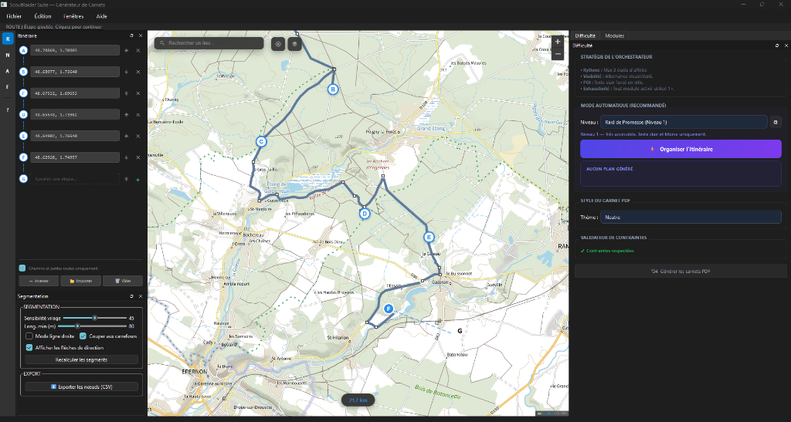
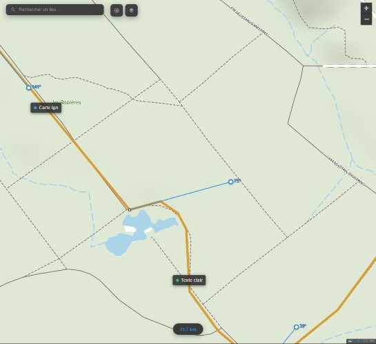
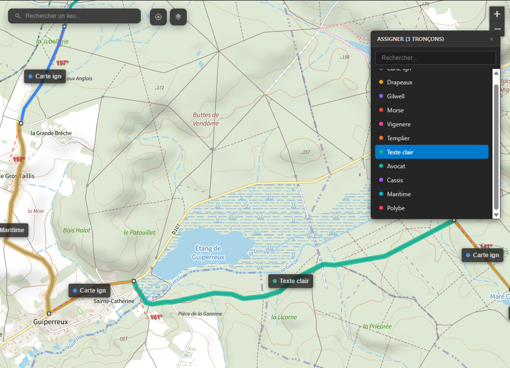
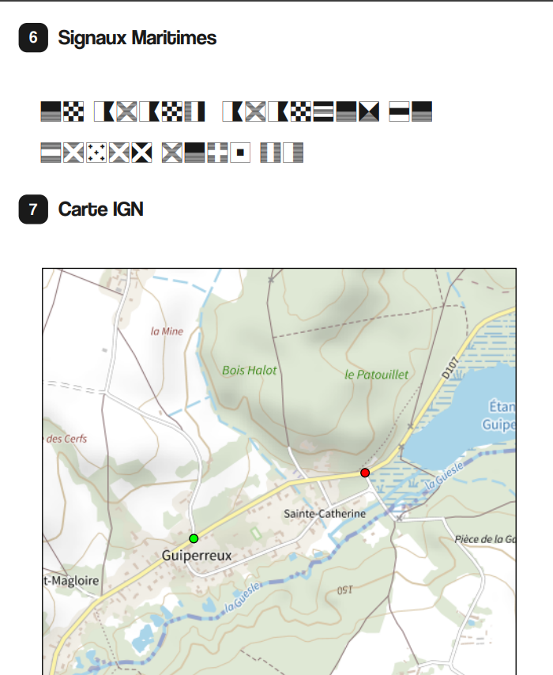

# 🏕️ ScoutRaider Suite — Générateur de Carnets de Raid

> **Version Beta 0.1.0** · Application de bureau pour planifier, concevoir et générer automatiquement des carnets de raid scout.

[](#installation)
[](#)
[](#avertissement-de-sécurité)

---

## ⚠️ Avertissement de Sécurité

> **IMPORTANT — À lire avant toute utilisation terrain**
>
> Les **azimuts, métrages et instructions** générés par cette application sont calculés **algorithmiquement** et **peuvent contenir des erreurs**.
>
> **Avant d'envoyer des scouts sur le terrain, il est IMPÉRATIF de :**
> - ✅ **Vérifier manuellement** chaque azimut et distance sur une carte IGN papier
> - ✅ **Reconnaître l'itinéraire** sur le terrain avant le jour J
> - ✅ **Corriger les azimuts** si nécessaire avec l'outil Azimut (A) de l'application
> - ✅ **Tester le carnet** en conditions réelles avec un chef avant distribution
> - ✅ **Prévoir un plan B** : points de ralliement, téléphone d'urgence
>
> L'équipe de développement **décline toute responsabilité** en cas d'erreur d'orientation liée aux données générées automatiquement.

---

## 🎯 Qu'est-ce que c'est ?

ScoutRaider Suite est un outil conçu pour les **chefs et cheftaines scouts** (Guides et Scouts d'Europe) qui organisent des raids et des randonnées. Il permet de :

1. **Tracer un itinéraire** sur une carte interactive (fonds IGN, satellite) ou importer un fichier GeoJSON
2. **Découper automatiquement** le tracé en segments avec azimuts et métrages calculés
3. **Encoder des épreuves** (Morse, Vigenère, azimut-distance, chiffres romains, etc.) le long du parcours
4. **Générer des carnets PDF** prêts à imprimer : un carnet participant et un carnet solution pour les chefs

---

## 📸 Aperçu

**Découvrez les capacités de ScoutRaider Suite avec ce carnet généré automatiquement :**
👉 **[Télécharger l'Exemple de Carnet (Thème Contrebandier)](Carnet_Contrebandier.pdf)**

### Interface de création
*(Ajoutez les captures d'écran ci-dessous dans le dossier `assets/screenshots/`)*

<p align="center">
  
  
</p>

### Encodage des épreuves
<p align="center">
  
  
</p>

---

## ✨ Fonctionnalités

| Fonctionnalité | Description |
|---|---|
| 🗺️ **Carte interactive** | Fonds de carte IGN, vue satellite, routage pédestre via BRouter |
| 🧭 **Segmentation intelligente** | Polygonalisation automatique avec détection des virages et carrefours |
| 📐 **Azimuts & métrages** | Calcul automatique, édition manuelle avec l'outil Azimut |
| 🎲 **11 modules d'épreuves** | Morse, Vigenère, azimut-distance, carte IGN, cadran solaire, etc. |
| ⚠️ **Alerte routes dangereuses** | Détection des portions à grande vitesse (motorways, nationales) |
| 📄 **Export PDF** | Carnet participant + carnet solution, thèmes visuels personnalisables |
| 📊 **Export CSV** | Export des nœuds avec coordonnées, azimuts et métrages |
| 💾 **Sauvegarde projet** | Format `.scoutproj` avec undo/redo complet |
| 🎨 **10 thèmes** | Contrebandier, Vikings, Mafia, Roi Soleil, Chevalerie, Gaulois, WW1, WW2, LOTR, Napoléon |

---

## 📦 Installation

### Prérequis

- **Python 3.9+** avec pip
- **Accès Internet** (pour les fonds de carte et le routage BRouter)

### Installation rapide

```bash
# 1. Cloner le dépôt
git clone https://github.com/bastonus/ScoutRaider-Suite.git
cd scout-design-suite/Generateur_Carnet

# 2. Installer les dépendances
pip install -r requirements.txt

# 3. Lancer l'application
python main.py
```

### Créer un exécutable (optionnel)

```bash
# Installer PyInstaller
pip install pyinstaller

# Lancer le build
python build.py
```

L'exécutable sera généré dans le dossier `dist/ScoutCarnet/`.

---

## 🚀 Guide d'Utilisation Rapide

💡 **Besoin d'aide ?** Utilise **l'Outil Aide (?)** situé en bas de la barre d'outils à gauche pour un guide interactif point par point !

### 1. Tracer l'itinéraire
- Sélectionne l'outil **Route (R)** dans la barre d'outils à gauche
- **Clique sur la carte** pour poser le point de départ (A), puis les étapes suivantes (B, C, D…)
- Le moteur calcule automatiquement le chemin pédestre entre chaque étape

### 2. Segmenter le tracé
- Va dans l'onglet **Segmentation** (panneau gauche)
- Ajuste la **sensibilité virage** et la **longueur minimale**
- Clique sur **« Recalculer les segments »**

### 3. Affiner les nœuds et azimuts
- **Outil Nœuds (N)** : ajouter/supprimer des points de segmentation
- **Outil Azimut (A)** : corriger manuellement la direction d'un segment
- ⚠️ **Vérifie chaque azimut** — les calculs automatiques peuvent être imprécis

### 4. Encoder les épreuves
- **Outil Encodage (E)** : clique sur un tronçon pour assigner une épreuve
- Ou laisse l'**Orchestrateur automatique** répartir les épreuves (panneau Difficulté)

### 5. Choisir le thème et exporter
- Choisis le **thème visuel** et la **difficulté** dans les panneaux à droite
- **Fichier → Exporter en PDF** (Ctrl+E) pour générer les carnets

---

## 🏗️ Architecture

```text
Generateur_Carnet/
├── main.py                      # Point d'entrée, workspace PySide6
├── main_orchestrator.py         # Moteur de génération PDF (ReportLab)
├── state_manager.py             # Gestion d'état, undo/redo, .scoutproj
├── refactor_polygonalisation.py # Algorithme de segmentation (GeographicLib)
├── version.py                   # Version centralisée
├── build.py                     # Script de build PyInstaller
├── ui/workspace/
│   ├── map_view.py              # Carte Leaflet (QWebEngineView)
│   ├── route_panel.py           # Panneau itinéraire
│   ├── tools_panel.py           # Panneau segmentation
│   ├── difficulty_panel.py      # Panneau difficulté & thèmes
│   ├── library_dock.py          # Bibliothèque de modules
│   ├── help_dialog.py           # Dialogue d'aide
│   └── style.qss               # Thème Adobe Photoshop CC
├── modules/                     # Épreuves (azimut, morse, vigenère…)
├── config/                      # Thèmes, presets, contraintes
└── utils/                       # IGN client, PDF helpers, background engine
```

---

## 🚀 Prochaines Fonctionnalités

ScoutRaider Suite est en **Beta**. Voici les améliorations prévues :

- 📦 **Distribution & Packaging** — Création d'installeurs (`.exe`, `.dmg`) et d'un **chercheur de mise à jour automatique** via GitHub
- 🔴 **Recherche inline** façon Google Maps intégrée au panneau
- 🔴 **Drag & Drop** des étapes sur la carte et dans la liste
- 🟡 **Import GPX / KML** depuis d'autres applications GPS
- 🟡 **Export HTML et DOCX** en complément du PDF
- 🟡 **Modules auto-découverts** — charger dynamiquement tout nouveau module
- 🟢 **Mode clair / sombre** — thème adaptable
- 🟢 **Onglets multi-projets** — travailler sur plusieurs itinéraires

---

## 💡 Suggestions & Feedback

Vos retours sont essentiels pour améliorer l'outil !

- 🐛 **Signaler un bug** → [Créer une Issue](https://github.com/bastonus/ScoutRaider-Suite/issues/new?labels=bug)
- 💡 **Proposer une fonctionnalité** → [Feature Request](https://github.com/bastonus/ScoutRaider-Suite/issues/new?labels=enhancement)

---

## 📜 Licence

*(Créé par Pierre-Albéric Théobald, chef de troupe de la Première Port-Marly)*

---

<p align="center">
  Fait avec ❤️ pour les scouts · **Créé par Pierre-Albéric Théobald, chef de troupe de la Première Port-Marly**
</p>
