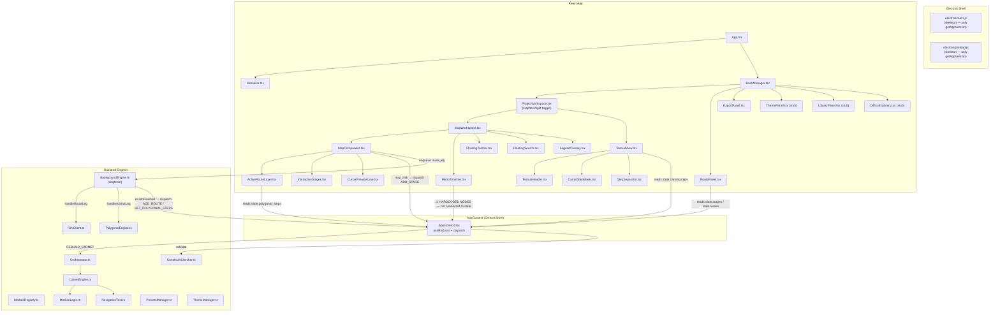

todo aussi autre chose que je voulais implémenter. Mais qui n'a pas qui n'a pas été bien implémenté, c'est quand on clique sur un tronçon. Si ce tronçon de nature Brouter donc qui suit les chemins et qu'on est avec l'outil polygone le deuxième outil le tracé h hors-piste. Et ben alors le tracé entre les par le chemin entre les deux étapes va se transformer en hors-piste. À l'inverse si on était sur le tracé pédestre p. Si on modifie si on clique entre le cours entre A et B et autres B et C sur sur le chemin tout le chemin va se transformer s'il était en tracé azimutale enfin tracer hors-piste en ligne droite, il va se transformer en chemin GPS Brouter. Et c'est donc ça qui n'a pas été bien implémenté pour l'instant. Tu dois peut-être avoir des traces de Scott mais en tout cas ça marche pas.


ajouter dans des paramètres en haut à droite la possibilité de changer les fonds de carte ign, notement les fonds gratuits de carte.gouv.fr, d'openstreetmap. et la possibilité d'ajouter les fonds de map de mapy.com avec une clé api (ajouter un tuto avec les liens précis pour y parvenir, la procédure étant expliquée dans https://developer.mapy.com/rest-api-mapy-cz/how-to-start/). également la possibilité d'ajouter les fonds de carte de communautés de l'ign (notemment le classique scan 25/100 il faut créer un compte sur https://cartes.gouv.fr/ puis aller sur https://cartes.gouv.fr/rejoindre-des-communautes rechercher scan 25/100 et faire une demande admin)

# Backend Modernization — Final Implementation Plan

> Integrates: `instruction ui.md` · `new forge instructions.md` · `next-features.md` · Full frontend audit · User decisions Q1–Q4

---

## Decisions Locked In

| Question | Answer |
|---|---|
| **Q1 — PDF** | HTML-first: write native HTML with page-break between steps, then `printToPDF()` for PDF and direct write for HTML |
| **Q2 — Fonts** | Copy to `public/fonts/` |
| **Q3 — POIs** | Fetch once after route calc, attach to each turning point, **persist in `.scoutproj`** (never recalc) |
| **Q4 — Tool bugs** | Fix Node/Azimut crashes **now** (Phase 0) |

---

## Frontend → Backend Data Flow Audit

After reading all 30+ components, here is the exact current wiring:



### Critical Gaps Identified

| Component | Current State | What's Missing |
|---|---|---|
| **MetroTimeline** | Hardcoded mock nodes, local `useState` | Must read `state.polygonal_steps` + `state.custom_assignments`, dispatch `ASSIGN_MODULES_RANGE` |
| **MapComponent** | Simple click→ADD_STAGE, route calc works | No anchor logic, no insertion mode, no stage drag, no debounced adjacent-leg recalc |
| **ActiveRouteLayer** | Renders segments with colors, arrows | Node drag doesn't update state, azimut drag handler empty, no label persistence fix |
| **ExportPanel** | UI complete with queue | `simulateJob()` is a mock — needs real `ExportService` + Electron IPC |
| **TextualView** | Reads `carnet_steps`, module change dispatches `REBUILD_CARNET` | `handleAddManualStep` / `handleRemoveStep` / `onNavLanguageChange` / `onPoiToggle` are stubs |
| **CarnetStepBlock** | Full UI with module picker, warnings, POI pills | POI pills read `step.pois` (always empty — no POI fetch), `onNavLanguageChange` is noop |
| **RoutePanel** | Shows stages with distances | `handleDelete` dispatches wrong action type, no drag-reorder, no search integration |
| **ThemePanel** | Stub (empty) | Needs to load themes from `ThemeManager`, dispatch `SET_THEME` |
| **DifficultyLibrary** | Stub (empty) | Needs to load presets from `PresetsManager`, dispatch `SET_PRESET` |
| **LibraryPanel** | Shows module cards, no interaction | Needs module details, toggle enable/disable |
| **StateManager** | `getInitialState()` + `addRoute()` only | No undo/redo, no serialize/deserialize, no `.scoutproj` I/O |
| **AppContext** | 15 actions handled | Missing ~15 more actions (see Phase 2 below) |
| **BackgroundEngine** | Works for route_leg + azimut_leg | `poi_search` handler is reverse-geocode only (not Overpass POI), no cancellation |

### What Already Works End-to-End ✅
1. **Route calculation**: Click map → `ADD_STAGE` → `BackgroundEngine.enqueue('route_leg')` → `IGNClient.computeRouteAlternatives()` → `ADD_ROUTE` → `ActiveRouteLayer` renders polyline
2. **Polygonalisation**: Route added → effect triggers `BackgroundEngine.enqueue('azimut_leg')` → `PolygonalEngine.processTrajectoryData()` → `SET_POLYGONAL_STEPS` → colored segments + azimut arrows rendered
3. **Carnet generation**: `REBUILD_CARNET` → `Orchestrator.calculateAssignments()` → `CarnetEngine.generateStepsFromPlan()` → `ConstraintChecker.validate()` → `TextualView` renders step blocks
4. **Tool switching**: `FloatingToolbar` → dispatch `SET_ACTIVE_TOOL` → `MapWorkspace` toggles MetroTimeline vs FloatingSearch

---

## Phase 0 — Fix Tool Crashes (P0, do immediately)

> From `next-features.md` §24: Node tool visibility bug + Azimut label persistence

#### [MODIFY] [ActiveRouteLayer.tsx](file:///d:/Documents/Scout%20Raider%20Suite/ScoutRaider%20-%20Electron/src/components/map/ActiveRouteLayer.tsx)

**Node tool fix (L178–194)**:
- `handleNodeDragEnd` currently only logs — must update `state.polygonal_steps` with new coordinates
- Node markers not appearing after add/remove — the node icon is rendered but only for `idx > 0`, missing index 0
- Need to dispatch `TOGGLE_NODE` action that modifies `masked_nodes`/`forced_nodes` in state

**Azimut label persistence (L124–175)**:
- Azimut labels (`<Marker>` with `azi-label` class) disappear because the `destPt` calculation depends on `seg.azimut` which gets cleared when the tool handler fires but doesn't write back
- Fix: The `dragend` handler on the azimut handle (L146) must call `dispatch({ type: 'UPDATE_AZIMUT', segIdx: idx, azimut: newAzi })` — this action doesn't exist yet → add it to AppContext

#### [MODIFY] [AppContext.tsx](file:///d:/Documents/Scout%20Raider%20Suite/ScoutRaider%20-%20Electron/src/AppContext.tsx)

Add the missing action:
```typescript
| { type: 'UPDATE_AZIMUT'; segIdx: number; azimut: number }
```

Handler: update `state.polygonal_steps[segIdx].azimut` and `.properties.azimut`

---

## Phase 1 — Electron Shell & Persistence

> **Priority: P0** — All other features depend on this.

### Files to modify

#### [MODIFY] [preload.js](file:///d:/Documents/Scout%20Raider%20Suite/ScoutRaider%20-%20Electron/electron/preload.js)

Expose IPC API: `saveScoutproj`, `openScoutproj`, `showSaveDialog`, `showOpenDialog`, `exportToFile`, `showExportDialog`, `onMenuAction`

#### [MODIFY] [main.js](file:///d:/Documents/Scout%20Raider%20Suite/ScoutRaider%20-%20Electron/electron/main.js)

IPC handlers for file I/O, native menus, `printToPDF()` via hidden BrowserWindow

#### [MODIFY] [StateManager.ts](file:///d:/Documents/Scout%20Raider%20Suite/ScoutRaider%20-%20Electron/src/logic/StateManager.ts)

Complete: undo/redo stacks, `serializeForSave()`, `deserializeFromLoad()`, schema migration

---

## Phase 2 — Complete AppContext Wiring

> **Priority: P0** — Components exist but dispatch to dead-ends.

#### [MODIFY] [AppContext.tsx](file:///d:/Documents/Scout%20Raider%20Suite/ScoutRaider%20-%20Electron/src/AppContext.tsx)

**Missing actions mapped from component audit:**

| Action | Dispatched By | What It Does |
|---|---|---|
| `UNDO` / `REDO` | MenuBar, keyboard | Call `StateManager.undo/redo()` |
| `LOAD_PROJECT` / `NEW_PROJECT` | MenuBar → Electron IPC | Replace entire state |
| `SET_THEME` | ThemePanel (stub) | `themeManager.setTheme()` + rebuild carnet |
| `SET_PRESET` | DifficultyLibrary (stub) | `presetsManager.setActivePreset()` + rebuild carnet |
| `UPDATE_AZIMUT` | ActiveRouteLayer azimut drag | Update `polygonal_steps[idx].azimut` |
| `TOGGLE_NODE` | ActiveRouteLayer node add/delete | Update `masked_nodes` / `forced_nodes` |
| `ASSIGN_MODULES_RANGE` | MetroTimeline selection | Update `custom_assignments` for range [start, end] |
| `REORDER_STAGES` | RoutePanel drag-and-drop | Reorder stages + recalc adjacent legs |
| `INVERT_ROUTE` | RoutePanel options menu | Reverse stages + full recalc |
| `SET_POLYGONAL_SETTINGS` | RoutePanel advanced params | Update settings + trigger repoly |
| `SET_SMALL_ROADS` | RoutePanel toggle | Update flag + trigger reroute |
| `INSERT_MANUAL_STEP` | StepSeparator "+" button | Insert manual step in `carnet_steps` |
| `REMOVE_MANUAL_STEP` | CarnetStepBlock delete | Remove manual step from `carnet_steps` |
| `SET_NAV_LANGUAGE` | CarnetStepBlock selector | Update step's `navLanguage` + re-encode |
| `TOGGLE_POI` | CarnetStepBlock POI pills | Toggle `poi.selected` + regenerate text |
| `SET_CARNET_VIEW` | TextualHeader toggle | Switch `participant` ↔ `solution` |
| `TOGGLE_GENERAL_MAP` | TextualHeader toggle | Set `carnet_include_general_map` |
| `TOGGLE_ANNEXE` | TextualHeader annexe picker | Add/remove annexe from global set |

**Side effects to add (via `useEffect` in AppProvider):**
- `state.stages` change → trigger `backgroundEngine.enqueue('route_leg')` for new/modified legs
- `state.routes` change → trigger `backgroundEngine.enqueue('azimut_leg')` (already done in `MapComponent.tsx` L109–127 — **move this to AppContext** so it fires regardless of which view is active)
- `state.polygonal_steps` change + POIs not yet fetched → trigger `backgroundEngine.enqueue('poi_search')` (Phase 3)
- Debounced auto-save effect (2s after any mutation)

> [!IMPORTANT]
> The azimut recalculation effect is currently inside `MapComponent.tsx` — it only fires when the map is mounted. If the user is in text mode, route changes won't trigger repoly. **Must move to AppContext.**

---

## Phase 3 — POI Service (Persistent)

> Per user decision Q3: fetch once after route calc, persist in `.scoutproj`

#### [NEW] [POIService.ts](file:///d:/Documents/Scout%20Raider%20Suite/ScoutRaider%20-%20Electron/src/logic/POIService.ts)

```typescript
class POIService {
  // Fetch POIs from Overpass for the bounding box of all segments
  static async fetchAllPOIs(segments: PolySegment[]): Promise<POI[]>
  
  // Assign nearest POI to each segment's turning point (within 150m)
  static assignPOIsToSegments(segments: PolySegment[], pois: POI[]): PolySegment[]
  
  // Get the POI already stored on a segment (for text generation)
  static getSegmentPOI(segment: PolySegment): string | null
}
```

#### [MODIFY] [types.ts](file:///d:/Documents/Scout%20Raider%20Suite/ScoutRaider%20-%20Electron/src/logic/types.ts)

Add to `PolySegment`:
```typescript
/** POI nearest to this segment's turning point (persisted in .scoutproj) */
poi?: { name: string; type: string; distance_m: number } | null;
```

#### Integration flow:
```
route_leg finished → azimut_leg finished → SET_POLYGONAL_STEPS 
  → useEffect: if segments have no POIs → enqueue poi_search (priority 3, background)
  → poi_search finished → dispatch SET_SEGMENT_POIS (updates segments in-place)
  → POIs are now part of state → serialized in .scoutproj → never recalculated
```

#### [MODIFY] [BackgroundEngine.ts](file:///d:/Documents/Scout%20Raider%20Suite/ScoutRaider%20-%20Electron/src/logic/BackgroundEngine.ts)

Replace `handlePoiSearch` (currently just reverse-geocode) with full Overpass API query:
- Query amenity/shop/historic/tourism within bounding box
- Match each segment's turning point to nearest OSM POI
- Return enriched segment array

---

## Phase 4 — MetroTimeline Rewrite

> Per `instruction ui.md` §4 — flat, minimal, no glow, module-colored segments

#### [MODIFY] [MetroTimeline.tsx](file:///d:/Documents/Scout%20Raider%20Suite/ScoutRaider%20-%20Electron/src/components/layout/MetroTimeline.tsx)

**Current problem**: Hardcoded mock data (`useState<MetroNode[]>([...])`) — not connected to `AppContext`.

**Rewrite:**
- **Data source**: Read `state.polygonal_steps` + `state.stages` + `state.custom_assignments` from `useApp()`
- **Node generation**: Map each `PolySegment` to a small node; detect stage boundaries from `state.stages` coords matching segment start coords → generate stage nodes (A, B, C)
- **Colors**: `MODULE_META[assignment].color` for assigned, neutral gray for unassigned
- **Visual style**: Per `instruction ui.md` §4:
  - Remove ALL glow effects (`boxShadow: 'none'`)
  - Thin line segments (2px), small dots (8px) for azimut nodes
  - Large circles (28px) with uppercase letter for stages
  - Flat/minimalist — no drop shadows, no blur
- **Selection**: Multi-select via Ctrl+Click, Shift+Click range, drag-box
- **Assignment dispatch**: On selection + module pick → `dispatch({ type: 'ASSIGN_MODULES_RANGE', startIdx, endIdx, moduleId })`
- **"Répartir automatiquement" button**: calls `Orchestrator` with current preset, only fills unassigned

---

## Phase 5 — Textual Mode Completion

> Per `new forge instructions.md` §2–5

#### [MODIFY] [TextualView.tsx](file:///d:/Documents/Scout%20Raider%20Suite/ScoutRaider%20-%20Electron/src/components/textual/TextualView.tsx)

Wire the stubs:
- `handleAddManualStep` → dispatch `INSERT_MANUAL_STEP` (create a manual `CarnetStep` with `isManual: true`)
- `handleRemoveStep` → dispatch `REMOVE_MANUAL_STEP`
- `handleNavLanguageChange` → dispatch `SET_NAV_LANGUAGE` → triggers live re-generation of `solutionText` + `encodedText`
- `handlePoiToggle` → dispatch `TOGGLE_POI` → toggles `poi.selected` → regenerates navigation text with/without POI mention

#### [MODIFY] [CarnetStepBlock.tsx](file:///d:/Documents/Scout%20Raider%20Suite/ScoutRaider%20-%20Electron/src/components/textual/CarnetStepBlock.tsx)

- **Auto-merge**: When `onModuleChange` is called and the new module matches the adjacent step → the reducer should merge the two steps (combine segments, recalculate distance/azimut)
- **Module-specific fonts**: Apply module fonts from `public/fonts/` (morse.ttf, templier.ttf, etc.)
- **Inline Leaflet maps**: For `carte_ign` and `drapeaux` steps, render a live `<MapContainer>` inside the step block showing the segment with IGN tiles
- **POI pills**: Now wired to real data from `step.pois` (populated by Phase 3)

---

## Phase 6 — Export Pipeline (HTML-first)

> Per user decision Q1: native HTML with page-break between steps

#### [NEW] [ExportService.ts](file:///d:/Documents/Scout%20Raider%20Suite/ScoutRaider%20-%20Electron/src/logic/ExportService.ts)

```typescript
class ExportService {
  // Generate the full carnet HTML (shared for HTML export + PDF conversion)
  static generateCarnetHTML(
    state: AppState,
    isSolution: boolean,
    options: { includeGlobalMap: boolean; annexes: AnnexeId[] }
  ): string
  
  // Write HTML file to disk via Electron IPC
  static async exportHTML(html: string, outputPath: string): Promise<void>
  
  // Convert HTML → PDF via Electron printToPDF
  static async exportPDF(html: string, outputPath: string): Promise<void>
  
  // CSV ledger export
  static generateCSV(state: AppState): string
}
```

**HTML generation details:**
- `@page { size: A4; margin: 20mm; }` with `page-break-after: always` between steps
- CSS `page-break-inside: avoid` on each step card
- Font embedding via `@font-face` with base64-encoded TTF from `public/fonts/`
- Map snapshots: use `leaflet-image` to capture mini-maps as base64 `` before export
- Cover page, step cards, annexe pages, global map pages — all matching legacy PDF structure

#### [MODIFY] [ExportPanel.tsx](file:///d:/Documents/Scout%20Raider%20Suite/ScoutRaider%20-%20Electron/src/components/panels/ExportPanel.tsx)

Replace `simulateJob()` with real `ExportService` calls via Electron IPC:
```typescript
// Instead of:
simulateJob(job, patch => updateJob(job.id, patch));

// Replace with:
const html = ExportService.generateCarnetHTML(state, false, options);
await window.electronAPI.exportFile(html, job.format, outputPath);
updateJob(job.id, { status: 'done', progress: 100, ... });
```

---

## Phase 7 — Panel Completion & Polish

#### [MODIFY] ThemePanel.tsx
- Load themes from `themeManager.getThemePreviews()`
- Display theme cards with preview and Vigenère key
- On select → dispatch `SET_THEME`

#### [MODIFY] DifficultyLibrary.tsx
- Load presets from `presetsManager.getAllPresets()`
- Display preset cards with module weights
- On select → dispatch `SET_PRESET`

#### [MODIFY] LibraryPanel.tsx
- Module cards from `ModuleRegistry` with colors, descriptions
- Read-only info panel (per `next-features.md` §19 — no drag-and-drop)

#### Fonts copy task
- Copy `legacy/modules/morse/assets/morse.ttf`, `legacy/modules/templier/assets/templier.ttf`, `legacy/modules/maritime/assets/mari-01.ttf` → `public/fonts/`

---

## Execution Order

```
Phase 0 (Tool fixes) ─────────────┐
                                    ├─→ Phase 1 (Electron Shell) ─→ Phase 2 (AppContext wiring)
                                    │                                    │
                                    │                               ┌────┴────┐
                                    │                               │         │
                                    │                          Phase 3    Phase 4
                                    │                          (POIs)    (Metro)
                                    │                               │         │
                                    │                               └────┬────┘
                                    │                                    │
                                    │                              Phase 5 (Textual)
                                    │                                    │
                                    │                              Phase 6 (Export)
                                    │                                    │
                                    └──────────────────────────── Phase 7 (Polish)
```

---

## Verification Plan

| Phase | Test |
|---|---|
| 0 | Drag node → verify segment updates visually. Drag azimut → verify label persists. |
| 1 | Save project → close → reopen → verify all state intact. Undo 5 × → redo 2 × → verify. |
| 2 | Change theme → verify carnet rebuilds. Change preset → verify assignments change. |
| 3 | Calculate route → verify POIs appear in step blocks. Save → reload → verify POIs still there. |
| 4 | Switch to Encodage tool → verify MetroTimeline shows real segments. Select range → assign module → verify colors update on map + metro. |
| 5 | Switch module on a step → verify live re-encoding. Add manual step via "+" separator. Toggle POI → verify text changes. |
| 6 | Export HTML → open in browser → verify page breaks between steps. Export PDF → verify fonts + maps render. |
| 7 | Select theme in panel → verify it applies. Select preset → verify orchestrator uses it. |
